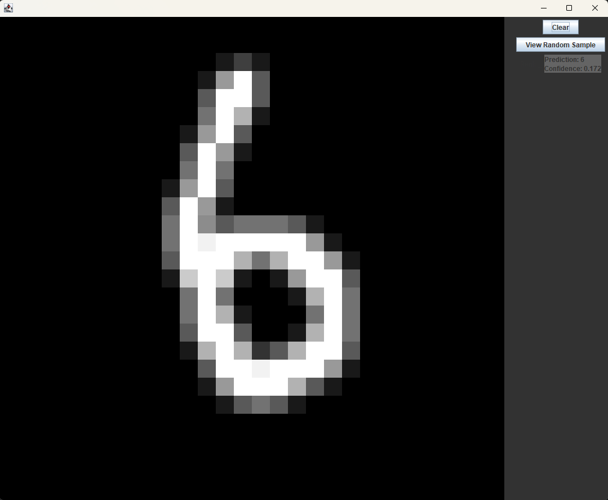

# JavaTorch

A poorly-named MNIST handwritten digit recognizer written in java with no dependencies.

# [Read the Blog Post Here](https://bhoener.github.io/posts/Java-MNIST-from-scratch)

## Installation
```shell
git clone https://github.com/bhoener/JavaTorch/
cd JavaTorch
```
## Use

### Pretrained demo
```shell
java .\gui.java
```

This will open a gui window that allows you to draw your own digits and have the network recognize them.



### Train a custom model
```shell
java .\train\train.java <run_name>
```
Where `<run_name>` is the name of the run, e.g. `bob`. 

This will run the training script, which should achieve ~`0.01` final MSE loss in a few minutes at the default settings, then display a few examples and their corresponding predictions, followed by a validation accuracy, which should be ~`0.93`. You can also train a slightly less accurate model (`0.91` val accuracy) in just a few seconds with the following config:
```javascript
{
    "hidden_dim": 20,
    "lr": 0.8,
    "lr_final": 0.02,
    "num_steps": 2000,
    "grad_accum_steps": 16
}
```

Feel free to mess around with these hyperparams in `./train/train.java` and try to get a more accurate model.


