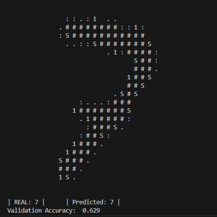

# JavaTorch

A poorly-named MNIST handwritten digit recognizer written in java with no dependencies.

## Use

```shell
git clone https://github.com/Trickshotblaster/JavaTorch/
cd JavaTorch
java .\train.java
```
This will run the training script, which should achieve ~`0.05` final MSE loss in a couple of seconds, then display a few examples and their corresponding predictions, followed by a validation accuracy, which should be ~`0.6`.

